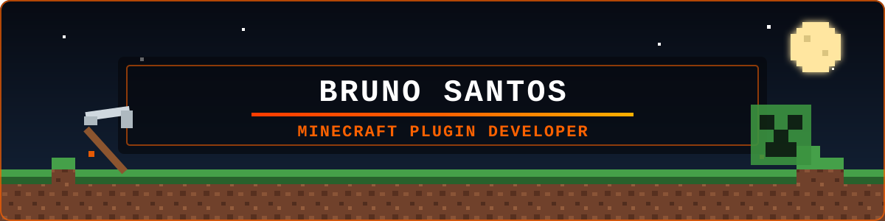

<div align="center">
  
</div>

<div align="center">
  
</div>

<div align="center">
  <a href="https://github.com/bndsantos?tab=followers">
    
  </a>
  
  
</div>

---

Meu servidor de testes: 143.14.168.212:26253 | Versão 1.21.11 +

## 👋 Sobre mim

Sou o **Bruno Santos**, desenvolvedor Java focado na criação de plugins e sistemas para servidores Minecraft.

Trabalho principalmente com **Paper, Velocity e MySQL**, desenvolvendo sistemas compartilhados entre vários servidores. Atualmente estou construindo uma suíte própria de plugins onde todos os projetos se comunicam através do **MundoCore**.

- ☕ Desenvolvimento com **Java 21**
- 🧱 Plugins para **Paper e Spigot**
- 🌐 Networks utilizando **Velocity**
- 🗄️ Persistência compartilhada com **MySQL/MariaDB**
- 🔗 Integrações com APIs REST, webhooks e pagamentos
- 🎮 Compatibilidade com jogadores Java e Bedrock

---

## ⛏️ Minha stack

### Linguagens e configuração

<div align="left">
  
  
  
  
  
</div>

### Minecraft

<div align="left">
  
  
  
  
  
  
  
  
</div>

### Banco de dados e integrações

<div align="left">
  
  
  
  
  
  
  
  
</div>

### Desenvolvimento e qualidade

<div align="left">
  
  
  
  
  
  
  
  
</div>

---

## 🧩 Projetos Mundo

<table>
  <tr>
    <td width="50%" valign="top">
      <h3>🌐 MundoCore</h3>
      <p>Núcleo responsável pelo banco de dados e pelos serviços compartilhados entre todos os plugins da network.</p>
      
      
      
    </td>
    <td width="50%" valign="top">
      <h3>🧭 MundoLobby</h3>
      <p>Sistema de lobby com menus, seletor de servidores, tablist, itens interativos e preferências persistentes.</p>
      
      
      
    </td>
  </tr>
  <tr>
    <td width="50%" valign="top">
      <h3>🛡️ MundoClans</h3>
      <p>Clans multi-servidor com membros, cargos, convites, alianças e informações compartilhadas.</p>
      
      
      
    </td>
    <td width="50%" valign="top">
      <h3>⚒️ MundoNetworkUTILS</h3>
      <p>Utilitários administrativos e sistema de punições globais para toda a network.</p>
      
      
      
    </td>
  </tr>
  <tr>
    <td width="50%" valign="top">
      <h3>💎 MundoCart</h3>
      <p>Compras dentro do jogo com PIX, QR Code em mapas e entrega automática após a confirmação.</p>
      
      
      
    </td>
    <td width="50%" valign="top">
      <h3>📦 Próximos projetos</h3>
      <p>Novos sistemas integrados ao MundoCore para economia, utilidades e experiências multi-servidor.</p>
      
    </td>
  </tr>
</table>

---

## 🐍 Minhas contribuições

<div align="center">
  <picture>
    <source media="(prefers-color-scheme: dark)" srcset="https://raw.githubusercontent.com/bndsantos/bndsantos/output/github-snake-dark.svg" />
    <source media="(prefers-color-scheme: light)" srcset="https://raw.githubusercontent.com/bndsantos/bndsantos/output/github-snake.svg" />
    
  </picture>
</div>

---

## 🧠 Como eu desenvolvo

```text
Ideia → Planejamento → Arquitetura → Implementação → Testes → Build → Servidor
```

<div align="center">
  
  
  
</div>

---

## 📫 Contato

<div align="center">
  <a href="dhtmjkn_87135">
    
  </a>
  <a href="https://github.com/bndsantos">
    
  </a>
  <a href="mailto:ecombrunobp@gmail.com">
    
  </a>
</div>

<br />

<div align="center">
  <strong>Desenvolvendo um bloco de cada vez. ⛏️</strong>
</div>


